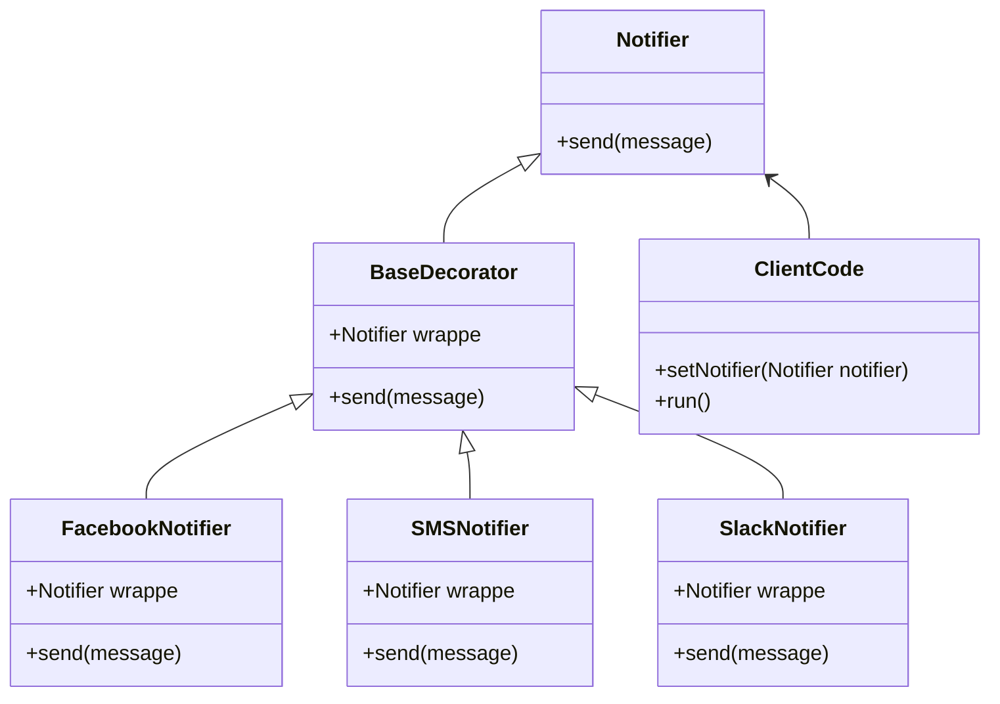

# Decorator pattern example in TypeScript

This is a simple decorator pattern example done in **TypeScript**. If you want to learn about Design patterns I highly recommend checking [Refactoring Guru](https://refactoring.guru/design-patterns).
To run the code example in this repo simply run this command at the root of your cloned repo `ts-node decorator.ts`

# Class Diagram

